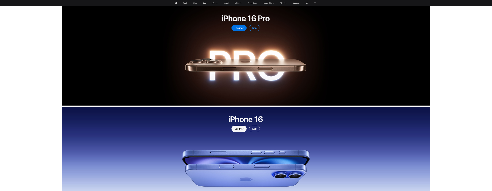
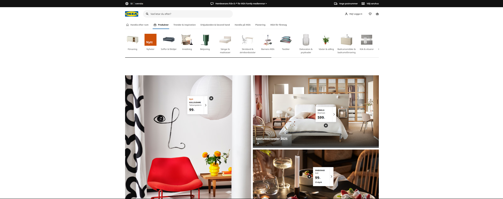
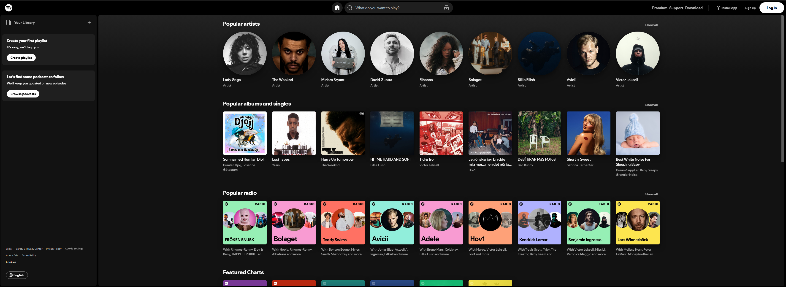

## Färganalys och Typografi
Syftet med uppgiften är att förstå hur designval påverkar webbplatsens visuella identitet och användarupplevelse.

## Urval
Urvalet gjordes för att jämföra designval från tre olika branscher: teknik, heminredning och digital underhållning
Detta val möjliggör en bredare analys av hur färg och typgrafi används för att förstärka respektive varumärkes profil.

De tre webblplatserna som jag har valt är:
  <li>
    <a href="https://www.apple.com" target="_blank">Apple</a> - En teknikjätte känd för minimalistisk design.
  </li>
  <li>
    <a href="https://www.ikea.com" target="_blank">IKEA</a> - En e-handelsplats med fokus på heminredning.
  </li>
  <li>
    <a href="https://www.spotify.com" target="_blank">Spotify</a> - En musikstreamingtjänst med en modern och ungdomlig profil.
  </li>

## Metod
För att genomföra undersökningen har följande metoder och verktyg använts.
1. Färganalysverktyg: Coolors för att identifiera och visualisera färgpaletter.
2. Typsnittsidentifiering. WhatFont-Verktyget för att identifiera H1-H3 och brödtextens typsnitt.
3. Skärmdumpar togs för att dokumentera hemsidornas design.

## Resultat
**Exempel 1 - Apple**

Färgpaletten jag kom fram till var. Vit, svart, gråskalor med inslag av blått.
Färgschemat verkar väldigt Monokromatiskt och minimalistiskt vilket ger en ganska "ren" stil till hemsidan.
Typsnittet de valt att använda sig av är SF Pro Display för H1-H3 och brödtexten.
Själva intrycket jag fick av hemsidan är nog att Apples design kännetecknas väldigt ofta med en ganska ren, enkel och exklusiv stil. Deras val av färger i gråskalor och diskreta blåtoner förstärker känslan av högkvalitativ teknologi. Typografin är modern och lättläst, vilket bidrar till en professionell och stilren upplevelse.

**Färgpalett:**
<table style="border-spacing: 4px; border-collapse: separate">
    <tr>
        <td style="height: 50px; width: 50px; background-color: #161618ff; border: 2px solid black;"></td>
        <td style="height: 50px; width: 50px; background-color: #121B59ff; border: 2px solid black;"></td>
        <td style="height: 50px; width: 50px; background-color: #FFFFFFff; border: 2px solid black;"></td>
        <td style="height: 50px; width: 50px; background-color: #8597D5ff; border: 2px solid black;"></td>
        <td style="height: 50px; width: 50px; background-color: #BEA599ff; border: 2px solid black;"></td>
        <td style="height: 50px; width: 50px; background-color: #7D675Eff; border: 2px solid black;"></td>
    </tr>
</table>

**Exempel 2 - Ikea**

Färgpaletten för IKEA:s hemsida var, Blått och gult vilket är IKEA:s varumärkesfärger, men även vitt med några gråa toner.
Färgschemat här var komplementfärger vilket också ger en ganska ren stil till hemsidan.
Typsnittet som används är främst Noto Sans och IKEA:s egna IKEA Sans.
Designintrycket jag fick här var att IKEA använder sina signaturfärger för att bygga igenkänning. Den blå och gula färkombinationen ger en vänlig och inbjudande känsla, medan den enkla och tydligan typografin säkerställer god läsbarhet och tydlighet i produktpresentationer.

**Färgpalett**
<table style="border-spacing: 4px; border-collapse: separate">
    <tr>
        <td style="height: 50px; width: 50px; background-color: #FFFFFFff; border: 2px solid black;"></td>
        <td style="height: 50px; width: 50px; background-color: #0058A3ff; border: 2px solid black;"></td>
        <td style="height: 50px; width: 50px; background-color: #322821ff; border: 2px solid black;"></td>
        <td style="height: 50px; width: 50px; background-color: #DFCA14ff; border: 2px solid black;"></td>
        <td style="height: 50px; width: 50px; background-color: #DCDAD9ff; border: 2px solid black;"></td>
        <td style="height: 50px; width: 50px; background-color: #C8C3BEff; border: 2px solid black;"></td>
    </tr>
</table>

**Exempel 3 - Spotify**

Färgpaletten här var främst svart och vit.
Färschemat däremot är ganska analogt och kontrasterande.
Typsnittet som förekommer främst är Circular för H1-h3 och brödtexten.
Designintrycket jag fick var att Spotifys färgval med svart och vitt ger en modern och ungdomlig känsla. Den runda och mjuka typografin i Circular förstärker den digitala och dynamiska identiteten och gör plattformen visuellt tilltalande för en yngre målgrupp. De flesta brukar oftast relatera en stark grön färg för Spotifys logga och hemsida, men nu för tiden har det ändrats någorlunda.

**Färgpalett**
<table style="border-spacing: 4px; border-collapse: separate">
    <tr>
        <td style="height: 50px; width: 50px; background-color: #080F18ff; border: 2px solid black;"></td>
        <td style="height: 50px; width: 50px; background-color: #18100Bff; border: 2px solid black;"></td>
        <td style="height: 50px; width: 50px; background-color: #FFFFFFff; border: 2px solid black;"></td>
        <td style="height: 50px; width: 50px; background-color: #D9D8D8ff; border: 2px solid black;"></td>
        <td style="height: 50px; width: 50px; background-color: #151415ff; border: 2px solid black;"></td>
        <td style="height: 50px; width: 50px; background-color: #000000ff; border: 2px solid black;"></td>
    </tr>
</table>

## Analys

De tre webbplatserna visar hur färg och typografi anpassas efter varumärkets budskap och målgrupp:

1. Apple använder en minimalistisk och monokrom design för att signalera exklusivitet och enkelhet.
2. IKEA använder sina varumärkesfärger för att förstärka igenkänning och skapa en välkomnande känsla.
3. Spotify kombinerar djärva färger och en modern typografi för att framhäva sin ungdomliga och innovativa profil.

Gemensamt för alla webbplatser är att färgvalen och typografin är konsekventa och speglar varumärkets identitet. En intressant iakttagelse är att teknik- och digitala företag ofta väljer monokroma eller dämpande färgscheman, medan varumärken med en mer fysisk produkt (som IKEA) använder varmare och mer traditionella färgkombinationer.

## Referenser

* WhatFont (webbläsartillägg.)
<li>
    <a href="https://www.apple.com" target="_blank">Apple</a>
</li>
<li>
    <a href="https://www.ikea.com" target="_blank">IKEA</a>
</li>
<li>
    <a href="https://www.spotify.com" target="_blank">Spotify</a>
</li>
<li>
    <a href="www.coolors.co" target="_blank">Coolors</a>
</li>

## Övrigt

Rapporten är skriven och skapad av Lucas Huynh (luhu23)